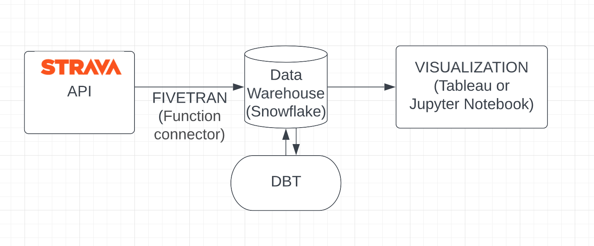

# 🚲 Strava rides visualizer
The goal of this project is to visualize all my bicycle rides on a dashboard that updates regularly (so new rides are added)

## 🥞 Tech Stack:

- Python
- Strava API
- AWS Lambda
- AWS S3
- FiveTran
- Snowflake
- DBT
- Tableau or Jupyter Notebook (TBD)

## ✅ What we have so far:
- grab_rides_history.py: Returns all my rides info from Strava API
- file.json: all my data from Strava until July 2023
